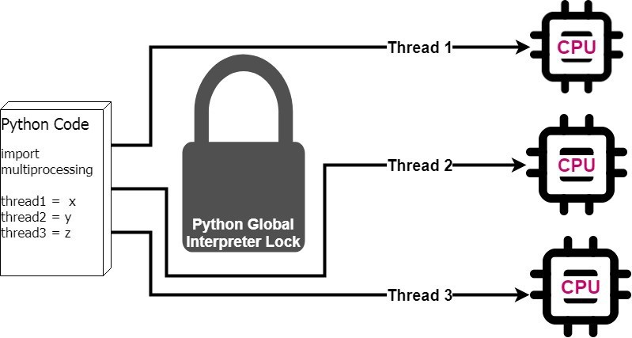

# Multi thread & Multi process

0. Sơ lược về *thread* & *process*

+ Process: được coi như quá trình hoạt động của một ứng dụng. Trong quá trình đó, sẽ có **main thread** đảm nhiệm vai trò chính của ứng dụng & các *sub threads* đảm nhiệm các tác vụ phụ trợ. 

    - Một thread có thể đảm nhiệm vai trò như một process, nhưng bản chất khác nhau ở quy mô/ độ phức tạp của tác vụ mà thread hay process có thể thực thi. 

    - Nhiều thread có thể nằm trong cùng một process, dùng một không gian bộ nhớ (address space) giống nhau. 

    - Các process khác nhau có vùng nhớ riêng.

+ Thread: là một đơn vị thực thi trong một process. 
    - Các thread trong cùng một process có chung địa chỉ nhớ. Điều này dẫn đến khả năng chia sẻ tài nguyên nhưng cũng có thể gây ra việc nhảy không mong muốn giữa các thread có thể gây ra dừng chương trình.
    - Quá trình động bộ hóa các thread giữ vai trò rất quan trọng.

1. Multiprocessing & multithreading in python

+ Trong python sử dụng cơ chế **G**lobal **I**nterpreter **L**ock (GIL). Cơ chế chỉ cho phép một thread thực thi tại một thời điểm.

    

+ Để khắc phục GIL, Python có phương thức *multiprocessing module* cho phép chỉ định code có thể bỏ qua cơ chế GIL & chuyển cho các process thực thi. 

    

+ Để check số lượng process tối đa có thể chạy trong ubuntu. Ngoài ra có thể tham khảo thêm *process_cmd.md*:
```
$ cat /proc/sys/kernel/pid_max
```
