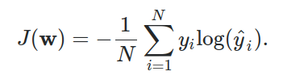

# Sự khác nhau giữa Categorical_cross-entropy vs Sparse_categorical_cross-entropy

+ Trong bài toán multi-class classification sử dụng mạng CNN sử dụng framework Keras, hai hàm loss thường được sử dụng là {categorical_cross_entropy & sparse_categorical_cross_entropy}. Sau đây mình sẽ tìm hiểu sự khác biệt giữa chúng.

## Giống nhau
+ Cả hai đều được sử dụng trong bài toán image classification.
+ Công thức toán học dùng chung:

    

## Khác nhau 
+ Output của mỗi loss khác nhau, cụ thể:
    - **sparse_categorical_crossentropy**: loss này có output có dạng số nguyên (trùng với số thứ tử của class) & đúng bằng số lượng class target (class_target < total_class). Vd: có 5 class, chỉ quan tâm đến class 1 & class 2 -> output: [1, 2].
    - **categorical_crossentropy**: output có dạng one-hot encoder theo target classes. Vd: quan tâm đến 2 class 1 & class 2 -> [[0, 1, 0, 0, 0]], [[0, 0, 1, 0, 0]]