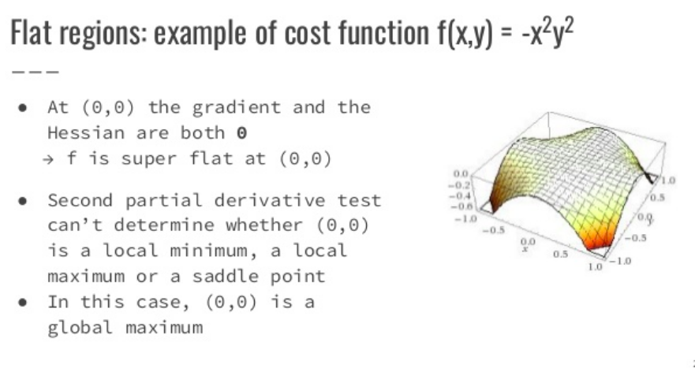

# Gradient Descent Optimization Algorithms

+ Tối ưu trong học máy quan tâm đến kết quả đo lường hiệu suất mô hình (P), được thực hiện trên tập test.
+ Quá trình tối ưu P dựa trên việc tối ưu cost function $J(\theta)$

## 1. Hàm tối ưu 
+ Hàm tối ưu còn được gọi là cost function, loss function ... Mục tiêu là tìm giá trị nhỏ nhất/lớn nhất cho hàm số.
+ Hai khái niệm cần quan tâm:
    - **Gradient**: được hiểu là đạo hàm bậc một của phương trình đa biến/xét trong không gian nhiều chiều.
    -  **Hessian**: đạo hàm bậc 2 của ma trận.

        

+ Đạo hàm từng phần bậc 2 (Second partial derivative)
    - Xét hàm $f$ đa biến
    - Stationary points (điểm dừng/cực trị): tại đó $\nabla f =0$
    - Sử dụng đạo hàm bậc 2 để kiểm thử:
        - Cứ nhớ đến bài đồ thị hàm số khi thi đại học ý.
    - Saddle point (điểm yên ngựa): tại đó Hessian đạt cả gía trị âm & giá trị dương. Hình minh họa:

         
## 2. Những thuật toán tối ưu cơ bản & han chế 

### 2.1 Batch Gradient Descent: quá trình.

    $\theta := \theta - \eta \nabla_\theta J(\theta)$

    - Khởi tạo kích thước bước nhảy (vận tốc)
    - Lựa chọn ngẫu nhiên điểm $\theta$
    - Tính toán đạo hàm $\nabla_\theta J(\theta)$ tại điểm $\theta$
    - Cập nhật giá trị $\theta$ đến mức ngưỡng nhỏ nhất mong muốn.

+ Đánh giá:
    - Nhược điểm: 
        - Cần tính toán đạo hàm cho **toàn bộ dữ liệu** 
        - Tốc độ tính toán chậm nếu không thực thi tối ưu.
    - Ưu điểm:
        - Hội tụ ổn định.

### 2.2 Stochastic Gradient Descent 
+ Tương tự Gradient Descent nhưng tại một thời điểm, ta **chỉ cập nhật** $\theta$ của hàm mất mát tại **chỉ một điểm dữ liệu** 
    - Một **epochs**: một lần duyệt qua tất cả các điểm trên toàn bộ dữ liệu -> mỗi epochs tương đương với một lần cập nhật $\theta$
    - Với SGD, mỗi epochs sẽ có *n* lần cập nhật $\theta$ với *n* là số điểm dữ liệu.
+ Cập nhật giá trị $\theta$:
    - Sau mỗi epoch, ta cần *shuffle* thứ tự các điểm dữ liệu để đảm báo tính ngẫu nhiên.
    - $\theta := \theta - \eta \nabla_\theta J(\theta; x_i; y_i)$
        - $J(\theta; x_i; y_i)$: hàm mất mát với chỉ một cặp điểm dữ liệu (input, label)

+ Đánh giá:
    - Ưu điểm:
        - Tốc độ hội tụ nhanh hơn *Batch Gradient Descent*
        - Hiệu quả khi học 'online' ~ khi cần cập nhật thêm dữ liệu, chỉ cần học thêm sẽ đạt hội tụ.
    - Nhược điểm:
        - Hội tụ không ổn định.
        - Không sử dụng các cách thức tối ưu vector

### 2.3 Mini-batch Gradient Descent 

## 3. Tối ưu trong học máy
### 3.1 Tối ưu lồi 
+ Trong học máy, các hàm mất mát thường được cố gắng chuyển về khả năng có thể tối ưu lồi.
+ Đôi khi, ta cũng sẽ gặp các trường hợp không lồi:
    - Nhiều điểm cực tiểu địa phương -> khó khăn khi tìm cực tiểu toàn cục.
        - Đôi khi, việc cố gắng tìm *global min* không hẳn tốt, có thể dẫn đến overfitting.
    - Các điểm yên ngựa cũng gây khó khăn.
        - Xét trong không gian nhiều chiều của hàm không lồi, điểm yên ngựa có số lượng nhiều hon so với *local min*.
        - Các điểm yên ngựa cũng ảnh hưởng đến quá trình training.
            - Với *Batch Gradient Descent* có thể bị mắc kẹt *stuck* tại điểm yên ngựa.
            - SGD có khả năng vượt qua điểm yên ngựa. 
    - ? Flat regions exist ~ một vùng có cùng giá trị trong một chiều nào đó trong không gian.
        - Vùng có giá trị các điểm là hằng số & đạo hàm bậc 2 *Hessian* đạt giá trị 0 -> khó phân biệt vùng cực tiểu hay vùng yên ngựa.
        - Vấn đề khi vùng này có gía trị hàm mất mát lớn.
        - Việc thoát khỏi vùng yên ngựa này khó.
        - vd: minh hoạt vùng yên ngựa 

            

## 4. Luyện tập gradient descent
