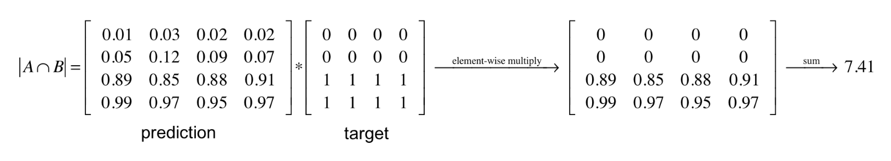

#  Phân tích các hàm loss function sử dụng trong Object Segmentations

+ Trong bài viết này, mình sẽ tổng hợp các hàm loss sử dụng trong object segmentation cũng như ưu & nhược điểm của mỗi loại. Ngoài ra, mình sẽ viết lại các hàm loss tích hợp vào customer model sử dụng framework - Keras. Deeper !

## 0. Định nghĩa hàm mất mát 
+ Trong Deep Learning, hàm loss đóng vai trò tính toán đạo hàm cho trọng số của mô hình (model weights) & cập nhật chúng thông qua cơ chế *backpropagation*. Hàm loss sẽ được tính toán & mô hình cập nhật 

## 1. Khai báo loss trong Keras 

+ Trong keras, loss được khai báo trong hàm *compile()*. Nhưng việc khai báo các hàm loss bởi việc sử dụng các loss class sẽ linh hoạt hơn.
+ Một ví dụ sử dụng loss có sẵn trong keras:
```
loss_function = keras.losses.SparseCategoricalCrossentropy(from_logits=True)
model.compile(loss=loss_function, optimizer='adam')
# model.compile(loss='sparse_categorical_crossentropy', optimizer='adam')
```

## 2. Các hàm loss cho bài toán Segmentation
+ Hiện tại mình chỉ tập trung phân tích các hàm loss mà minh quan tâm, nếu bạn đọc muốn tìm hiểu thêm xin vui lòng đọc bài viết gốc [Link](https://neptune.ai/blog/keras-loss-functions#:~:text=Creating%20custom%20Loss%20functions%20in%20Keras&text=A%20custom%20loss%20function%20can,passed%20at%20the%20compile%20stage.)

### 2.1 Pixel-wise cross entropy loss 
+ Entropy:
    - Trung bình thông tin của biến ngẫu nhiên rời rạc ~ sự phân bố các điểm ảnh 255. 
    - Entropy H của một phân phối xác suất:    
    $H(p)= -\sum_{i=1}^{n} p_i log_i^p_i$

+ Hàm loss này được dùng phổ biến cho bài toán segmentation. Việc tính toán loss thực hiện trên từng điểm ảnh. Chính bởi cross entropy loss thực hiện tính toán giữa điểm ảnh dự đoán & điểm ảnh thực.

### 2.2 Dice loss 
+ Hàm loss này thực hiện đo độ khớp giữa 2 mẫu. Giá trị sẽ trong khoảng (0, 1)


+ Công thức tính:
$Dice=\frac {2|A \cap B|}{|A|+|B|}$

+ Minh họa cách tính:


## Tài liệu tham khảo (mục này phải viết thứ 2)
[An overview of semantic image segmentation.](https://www.jeremyjordan.me/semantic-segmentation/#loss)
[Các hàm loss thông dụng trong Machine Learning](http://naebolo.com/cac-ham-loss-thong-dung-trong-machine-learning/)
[Keras Loss Functions: Everything You Need To Know](https://neptune.ai/blog/keras-loss-functions#:~:text=Creating%20custom%20Loss%20functions%20in%20Keras&text=A%20custom%20loss%20function%20can,passed%20at%20the%20compile%20stage.)
[How to create a custom loss function in Keras](https://heartbeat.fritz.ai/how-to-create-a-custom-loss-function-in-keras-637bd312e9ab)
