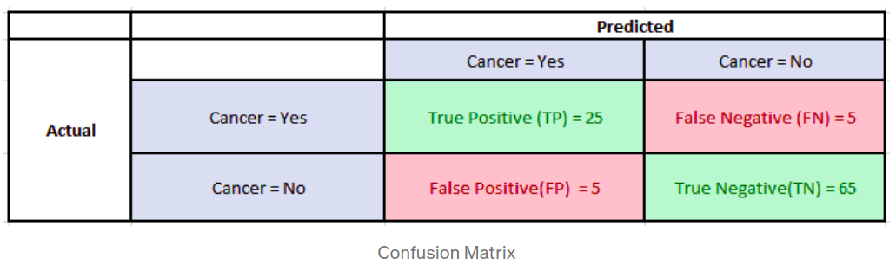

# Metrics to Evaluate Segmantic Segmentation Model

+ Bài viết này dịch từ bài viết cùng tên trên Medium.

## 1. Độ chính xác điểm pixel 
+ Hiểu đơn giản là độ chính xác điểm pixel dự đoán.
+ Đánh giá:
    - Ưu điểm:
        - Dễ hiểu 
    - Nhược:
        - Khi xảy ra trường hợp mất cân bằng vùng điểm ảnh -> tập background lớn => mô hình dự đoán sai vẫn cho đọ chính xác cao.

## 2. IoU 
+ Cách tính: $\frac{Vùng trùng}{tổng vùng giao}$
+ Đối với trường hợp *binary (2 classes)* hoặc *multi-classes* segmentation (m-classes):
$IoU = \frac{1}{m} \sum_{i=1}^{m} \frac{Overlap_i}{Union_i}$

+ Xét 2 ảnh predicted segmentation & ground truth annotation:

    
        - Giả sử, ảnh có 100 pixels/mỗi ảnh -> vùng trùng giao sẽ là tổng pixels của 2 ảnh (200 pixels). 
        - Ảnh tàu có tổng 5 pixels & ảnh background có 95 - pixels.
        - Xét vùng segmentation tàu:
            - Overlap: 0  
            - Union: $(5_pred + 0_background) - 0_overlap = 5$  
        - Xét vùng segmentation background:
            - Overlap: 95
            - Union: $(95_pred + 100_background) - 95_overlap$
        - IoU=95% & mean IoU: 95/2 = 47.5%

## 3. Dice Coefficient 
+ Có thể coi F1-score là trung bình điều hòa (harmonic mean) của Precision & Recall
    - Có xu hướng lấy giá trị gần với giá trị nào nhỏ hơn giữa Precision & Recall 
    - F1 đồng điệu với Precision & .
+ Công thức tính:
    

+ Xét lại ví dụ ở mục 2
    - Tổng điểm ảnh: 200
    - Dice score ship: *(2 x Area of Overlap)/(total pixels combined)* = 2*0/200
    - Dice score background: *95x2/200=0.95* 
    - Dice: 0.95/2 = 0.475

## Đánh giá cá nhân:
+ Về bản chất việc sử dụng cả 2 metrics để đánh giá/so sanh các mô hình có ý nghĩa như nhau. 
    - IoU đồng biến với F-score.

+ Sự khác biệt xảy ra khi xét model B kém hơn model A như thế nào 
    - IoU có xu hướng xử phạt trường hợp đơn lẻ phân loại mạnh hơn F-score. Tương tự như cách L2 xử phạt sai sót mạnh hơn L1. 
    - IoU có xu hướng bình phương ảnh hưởng của lỗi so với F-score.
    - F1-score có xu hướng đo lường sắp xỉ hiệu suất trung bình của Precision & Recall.
    - IoU có xu hướng đo lường gần hiệu suất trường hợp tệ 
+ Xét vd bài toán segmentation có các tham số:
        

    - F-score ~ 0,83
    - IoU tệ hơn ~ 0,79047619
    - Một lỗi nhỏ có thể ảnh hưởng nghiêm trọng đến điểm trung bình trên toàn ảnh.