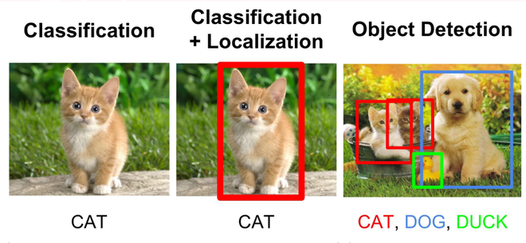
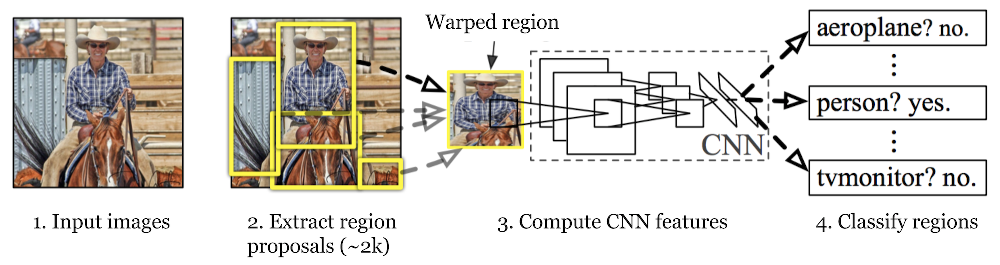

# Region-Convolutional Neural Network series

Trong notes này, mình sẽ đề cập đến họ mạng R-CNN. Trước khi đi phân tích, chúng ta nên làm quen với các dạng bài toán cơ bản nhất trong Computer Vision. 
    - Image recognition: nhận diện vật thể trong ảnh/video.
    - Image classification: phân loại/nhận biết đối tượng (có thể hiểu gãn nhãn object).
    - Object localization: được hiểu là công việc vẽ 1 bounding box cho đối tượng (khoang vùng sự tồn tại của đối tượng).
    - Object detection: kết hợp 2 nhiệm vụ: vẽ bounding box + nhận biết đối tượng.

## Region-based Convolutional Neural Networks

+ Nhận xét:
    - Sử dụng Convolutional Neural Network để detect & semantic segmentation object.
    - 
+ RCNN gồm các bước:
    - Sử dụng thuật toán *selective search* để đưa ra các bounding boxes (~2000) hay còn gọi là *region proposal*. Chứa các vùng có thể chứa object.
    - Sử dụng **pre-trained** CNN (vd: VGG, ResNet ...) để tính toán feed-forward các regions tử *feature maps*. Sau đó sử dụng SVM xác định object trong *region proposal*.
    - Sử dụng Linear Regression để hiệu chỉnh các giá trị.

## Tài liệu tham khảo
(Bài 12 - Các thuật toán Object Detection)[https://phamdinhkhanh.github.io/2019/09/29/OverviewObjectDetection.html#:~:text=M%E1%BA%A1ng%20%C4%91%E1%BB%81%20xu%E1%BA%A5t%20khu%20v%E1%BB%B1c,c%C3%A1c%20bounding%20box%20v%C3%A0%20nh%C3%A3n.]

(RCNN, Fast-RCNN, Faster-RCNN Series summary)[https://www.programmersought.com/article/38332027484/]

(Object Detection for Dummies Part 3: R-CNN Family)[https://lilianweng.github.io/lil-log/2017/12/31/object-recognition-for-dummies-part-3.html]

()[]
