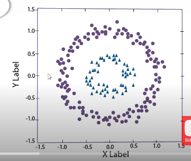

# Activation function 

## Tại sao cần sử dụng weight 
- Các trọng số weight 

## Tại sao cần sử dụng activation function 

+ Vấn đề xuất hiện khi tập dữ liệu cần học phức tạp, khó đưa decision bounding. Sử dụng 

+ Tăng độ phức tạp của mạng, giúp học sâu hơn.

## Vanishing gradient problem
