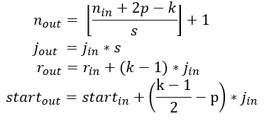

# Hương dẫn tính toán Reception Field trong mạng CNN

## Sơ lược 

+ Trong mạng CNN, *convolutional layer* là thành phần quan trọng nhất. Nó đảm nhiệm phát hiện các đặc trưng có tính không gian của ảnh đầu vào. Có 4 thành phần chính trong tầng này:
    - Ma trận đầu vào (thường là ma trận 3 chiều).
    - Filters (phân tích các đặc trưng của ảnh đầu vào).
    - Receptive field (Phần bị filters phân tích nằm trên ảnh).
        - The *receptive field* is defined as the region in the input space that a particular CNN'feature is looking at.
    - Feature map (Ma trận kết quả).

## Mô phỏng CNN's feature map

+ Tính kích thước output features:

    

    - Với mạng CNN có kiến trúc đối xứng & ảnh đầu vào hình vuông, giá trị sẽ bằng nhau ở mỗi chiều.

    - Với mạng CNN hoặc ảnh đầu vào không đối xứng, tính toán feature map độc lập theo mỗi chiều.

+ Mô phỏng feature map: 

    

    - Ảnh nửa bên trái, mô phỏng cách họat động chung của mạng CNN feature map.

    - Ảnh nửa bên phải, mô phỏng cách hoạt động của mạng CNN có kích thước feature map bằng với kích thước ảnh đầu vào. 

+ Trong mỗi receptive field, phần tử trung tâm đóng vai trò quan trọng trong việc phân tích feature map. Đó cũng là lý do chính các filer thường có kích thước là số lẻ (3x3 hoặc 5x5).
    - Filter có kích thước nhỏ thường được ưu tiên sử dụng (3x3). Đổi lại việc tính toán sẽ nhiều hơn. Một vài ưu điểm:
        - Đặc trưng phân tích được sẽ mang tính cục bộ.
        - Đặc trưng phân tích sẽ đa dạng & mang nhiều thông tin.

## Tính toán Receptive Field

+ Các thông số cần quan tâm:
    - *n*: số lượng đặc trưng trong mỗi chiều.
    - *r*: kích thước của *receptive field* đang xét.
    - *j*: bước nhảy giữa 2 features (stride)
    - *Conv* {k: kernel_size, p: padding_size, s: stride_size}

    

## Tài liệu tham khảo

+ https://medium.com/mlreview/a-guide-to-receptive-field-arithmetic-for-convolutional-neural-networks-e0f514068807

+ http://zike.io/posts/calculate-receptive-field-for-vgg-16/

+ https://pbcquoc.github.io/cnn/#:~:text=v%E1%BA%ADt%20th%E1%BA%BF%20g%C3%AC.-,Convolution%20Layer,c%E1%BB%A7a%20c%E1%BB%A7a%20m%C3%B4%20h%C3%ACnh%20CNN.&text=Ph%E1%BA%A7n%20t%C6%B0ng%20%E1%BB%A9ng%20n%C3%A0y%20tr%C3%AAn,%C4%91%C6%B0%E1%BB%A3c%20g%E1%BB%8Di%20l%C3%A0%20feature%20map.

+ https://arxiv.org/pdf/1603.07285.pdf

