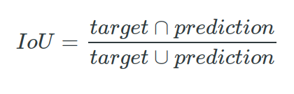
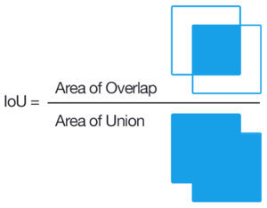
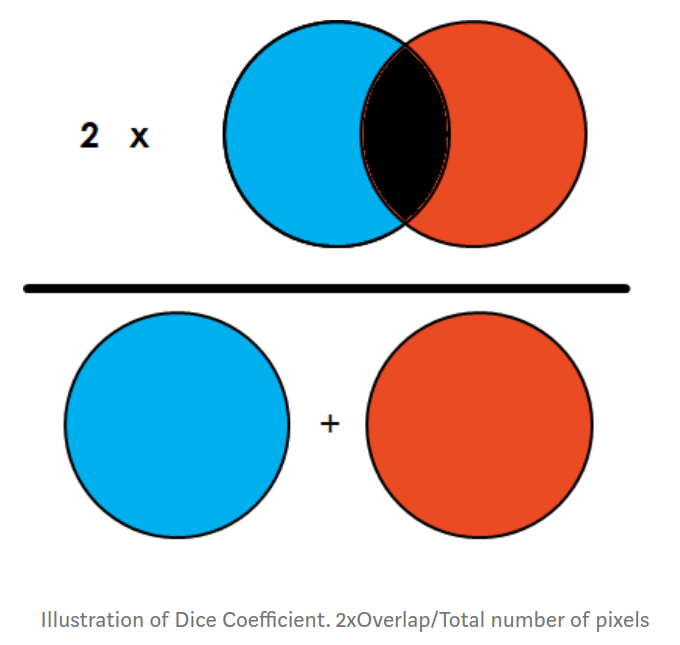

# Metrics to Evaluate your Semantic Segmentation Model


## 1. Pixel accuracy

+ Được tính bằng phần trăm các điểm pixel trên ảnh của bạn được phân loại chính xác.

+ Đánh giá:
    - Ưu điểm:
        - Đơn giản, dễ hiểu 
    - Nhược điểm: 
        - Với trường hợp, diện tích phần nền rất lớn & phần cần segmentation rất nhỏ (~class imbalance), độ chính xác trả về sẽ không đánh gía hiệu quả thuật toán.


## 2. Intersection over Union

+ Phần trăm độ khớp/trùng về diện tích vùng dự đoán trên diện tích vùng gán nhãn. Nếu có nhiều class hoặc nhiều vùng sẽ lấy trung bình phần trăm độ khớp của tất cả. (0% - 100%). Công thức tính:

    

+ Minh họa:

    

+ Implement (pytorch):
```
import pytorch

bias = 1e-6 # to avoid worst case: 0/0

def iou_pytorch(outputs: torch.Tensor, labels: torch.Tensor):
    """
    outputs & labels: m*h*w*n
        - m: the number of images
        - h: the number of rows
        - w: the number of columns
        - n: the number of classes
    """
    # outputs: batch*h*w*1 shape -> batch*h*w (binary -> n = 1)
    outputs = outputs.squeeze(1)

    intersection = (outputs & labels).float().sum((1, 2))
    union = (outputs | labels).float().sum((1, 2))
    iou = (intersection + bias)/(union + bias)

    thresholded = torch.clamp(20* (iou - 0.5), 0, 10).ceil() / 10

    return thresholded  
```


## 3. Dice Coefficient (F1 score)

+ Công thức: 
    ```
    dice_coefficient = 2*(intersection) / (pixel_image_1 + pixel_image_2)
    ```

    

+ Ví dụ: Giả sử tìm vùng xương răng trên hình ảnh. Tổng số lượng pixel trên 2 ảnh là 200. 
    - vùng khớp của răng giữa mô hình dự đoán & ground-truth: 0%    
        - *dice_bone = 0*
    - vùng khớp của backgroup giữa mô hình dự đoán & ground-truth: 85%
        - *dice_background = 85*2/200 = 85 %*
    - *dice = (85 + 0)/2 = 42.5%*

+ Implement:
```
import pytorch

bias = 1e-6 # to avoid worst case: 0/0

def iou_pytorch(outputs: torch.Tensor, labels: torch.Tensor):
    """
    outputs & labels: m*h*w*n
        - m: the number of images
        - h: the number of rows
        - w: the number of columns
        - n: the number of classes
    """
    # outputs: batch*h*w*1 shape -> batch*h*w (binary -> n = 1)
    outputs = outputs.squeeze(1)

    intersection = (outputs * labels).sum(dim=-2).sum(dim=-1) 
    union = (labels).sum(dim=-2).sum(dim=-1) + (outputs).sum(dim=-2).sum(dim=-1)
    dice = (intersection*2)/(union + bias)

    return dice.mean()  
```