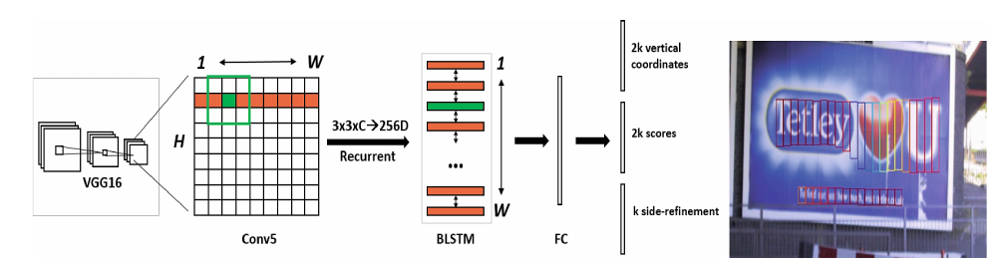

# Multitask Learning

## Overview
Trong quá trình tối ưu hàm loss cho bài toán Text Detection, mình biết tới **multitask learning**. Phần lý thuyết, mình sẽ tóm lược lại bài viết rất chi tiết của anh Khánh, phần ứng dung sẽ dùng với dự án của mình.

### 1. Giới thiệu multitask learning
+ Bài toán đặt ra, một mô hình cần thực hiện nhiều tác vụ. Vd: bài toán text detection, mô hình đưa ra dự đoán về vị trí + khả năng xuất hiện text trong 1 proposal ~> bài toán 2 tác vụ (tương đương với 2 loss functions). 

### 2. Tìm hiểu về multitask learning

#### 2.1 Kiến trúc thuật toán multitask learning
+ Về cơ bản, kiến trúc của multitask learning cũng gần giống với transfer learning.
    - Phase 1: Base network dùng để extract features, sẽ tạo ra output đặc trưng cho tất cả các nhiệm vụ.
    - Phase 2: Các đặc trưng kết quả của phase 1 sẽ được dùng làm đầu vào cho các bài toán con (tasks).
+ Ví dụ: xét kiến trúc của CTPN
        

    - Mô hình có 3 output đầu ra ~ 3 tasks dự đoán về tọa độ vertical proposals, tỉ lệ xuất hiện text trong text proposals & offset của sàng lọc biên <~> 3 loss functions.
    
#### 2.2 Mã hóa output cho multitask learning
+ Mô hình multitask leanring sẽ học tất cả các task trên cùng 1 model. Output mỗi nhiệm vụ sẽ tách biệt (vd: với classification {0, 1} cho mỗi object).

#### 2.3 Sự khác biệt Multi-task với Transfer learning.
+ Multi-task là quá trình thực hiện nhiều bài toán phân loại nhị phân đồng thời.
    - Mỗi task sử dụng sigmoid.
+ Transfer learning là một bài toán nhị phân với C classes -> phân phối xác suất là hàm softmax

#### 2.4 Hàm loss function
+ Bài toán của mình là tối ưu cho bài toán text detection, hàm loss function của mô hình là tổng của các hàm loss thành phần.
+ Các hàm loss function cơ bản:
    - Hàm loss function cho bài toán nhị phân:

        

    - Trường hợp phân loại có C - classes. Đồng thời ta sử dụng hàm softmax để tính phân phối xác suất:
        
    
    - Trong bài toán multitask learning, đối với mỗi tác vụ sẽ có giá trị hàm loss function riêng:

        

    - Khi có C-tasks, hàm loss function sẽ là tổng của các hàm loss thành phần:

        

## Tài liệu tham khảo 

[Bài 34: Multitask Learning - phamdinhkhanh.github.io](https://phamdinhkhanh.github.io/2020/04/22/MultitaskLearning.html)