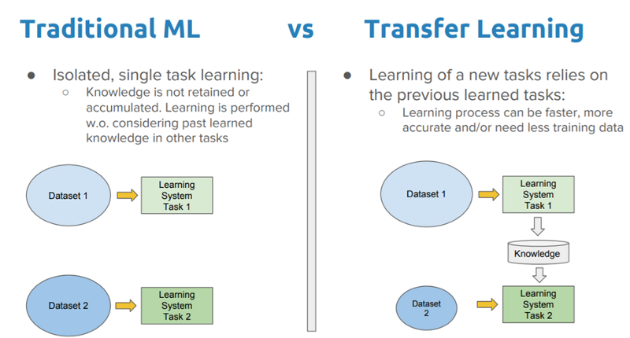
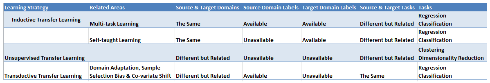
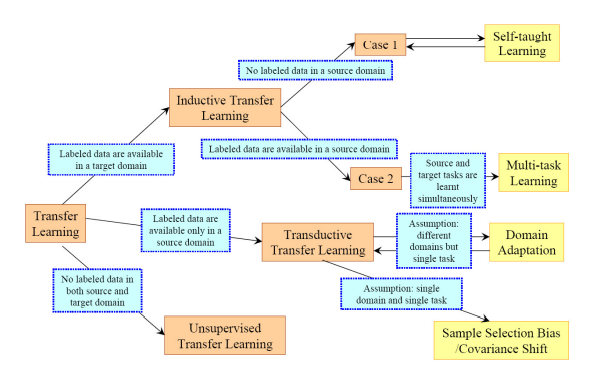
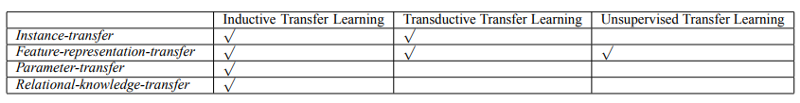

# Transfer Learning
+ Đây là "Quickly notes" của bản thân mình nên chỉ tập trung vào ý chính của bài viết. Mình có đính kèm link tới bài viết gốc để tôn trọng công sức tác gỉa, cụ thể ở đây là anh Thướng.

## 1. Transfer learning là gì ? 
+ Tận dụng các model đã được train trên các tập dữ liệu lớn (vd: imagenet - 1000 classes). Kết quả là học được các đặc trưng từ mô hình trước, đỡ tốn chi phí training, hiệu quả khi gặp trường hợp dữ liệu ít ...

    

## 2. Phân loại Transfer Learning

### 2.1 Phân loại theo chủ đề nghiên cứu

+ Các câu hỏi đề quyết định lựa chọn transfer:
    - Transfer cái gì ?
        - Phần nào của đặc trưng đã học có thể transfer ?
    - Transfer khi nào nên & không nên transfer ?
    - Transfer như thế nào ?
    
    

### 2.2 Phân loại theo domains 
+ Introductive transfer learning: 
    - Cùng domain 
    - Khác domain
+ Transductive transfer learning: giống nhau về nhiệm vụ nhưng khác nhau về domain
+ Unsupervised Transfer Learning: Giống inductive transfer learing nhưng targer task ở dạng unsupervised learning.

    

### 2.3 Phân loại theo hướng tiếp cận
+ Instance transfer: Dùng loại tri thức từ source domain 
+ Feature representation transfer: Giảm thiểu sự khác biệt giữa 2 domain
+ Parameter transfer: Dựa trên các giả thiết các task liên hệ với nhau có cùng phân bố về bộ thông số hyper parameters.

    

## 3. Transfer learning cho Deep Learning

## Tài liệu tham khảo 
[Tổng hợp Transfer Learning](https://forum.machinelearningcoban.com/t/tong-hop-transfer-learning/5388/1)